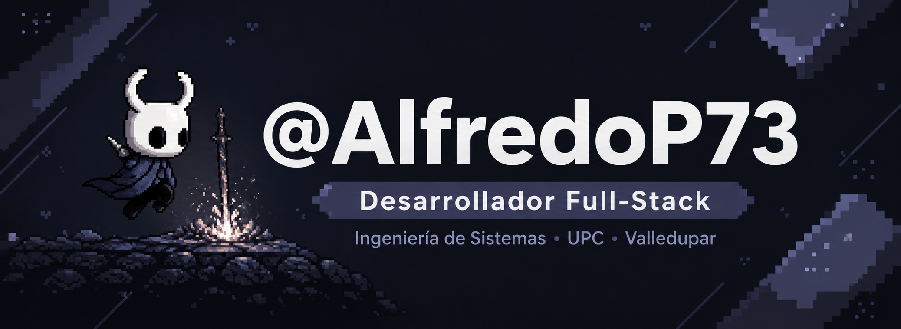

<div align="center">



<a href="https://github.com/AlfredoP73">
  
</a>

<br/>

[](https://github.com/AlfredoP73)
[](mailto:alfredojoseperezmeza124@gmail.com)
[](https://www.instagram.com/thely0n_king/)
[](https://t.me/thely0n_king)

</div>

---

## 👨🏻‍💻 Sobre mí


```python
class AlfredoPerez:
    nombre      = "Alfredo José Pérez Meza"
    usuario     = "AlfredoP73"
    ubicacion   = "Valledupar, Cesar, Colombia 🇨🇴"
    educacion   = "Ing. Sistemas — UPC (9no semestre)"

    enfoque     = [
        "🌐 Full-Stack Web Development",
        "🔩 Microservicios & APIs REST",
        "🧩 Patrones de Diseño GoF",
        "🤖 IA Generativa (Gemini API)",
        "📄 Automatización de documentos",
    ]

    aprendiendo = ["C#", "Cloud (AWS)", "Arquitecturas escalables"]
    hobbies     = ["🏋️ Gym", "🎮 Gaming", "🎬 Sci-Fi"]

    def saludo(self):
        return "¡Construyendo software que importa! 🚀"
```

<br/>

- 🎓 Estudiante de **Ingeniería de Sistemas** en la Universidad Popular del Cesar
- 💡 Me apasiona construir soluciones reales con código limpio y bien estructurado
- 🔭 Trabajando en proyectos con **FastAPI**, **React** y **NestJS**
- 🧩 Aplicando patrones **GoF** en arquitecturas escalables
- 🌱 Explorando **Cloud**, **Docker** y servicios de **IA generativa**
- ⚡ Fan de Hollow Knight, los videojuegos indie y las películas de ciencia ficción

<br clear="right"/>

---

## 🛠️ Stack tecnológico

<div align="center">
  
</div>

<div align="center">
  
  
</div>

---

## 🚀 Proyectos destacados

<div align="center">

### ⚡ [TaskFlow](https://github.com/AlfredoP73/taskflow)
> Plataforma colaborativa de gestión de tareas implementando **12 patrones de diseño GoF**


---

### 🥗 [eNutriTrack](https://github.com/AlfredoP73/enutritrack)
> App web de seguimiento nutricional con **microservicios** e **IA Generativa (Gemini API)**


---

### 🎓 [SIDINAL](https://github.com/AlfredoP73/sidinalupc-server)
> Sistema de gestión académica con arquitectura **SaaS** y modelo financiero proyectado a 5 años


---

### 🏥 [Clínica Paliativos](https://github.com/AlfredoP73/clinica_paliativos)
> Sistema de gestión para clínica de cuidados paliativos


---

### 💼 [NomiWise](https://github.com/AlfredoP73/NomiWise)
> Sistema de gestión de nómina empresarial


</div>

---

## 📊 Estadísticas de GitHub

<div align="center">


<br/>


<br/>


<br/>


<br/>


</div>

---

## 🐍 Contribuciones

<div align="center">
  
</div>

---

<div align="center">
  
</div>
